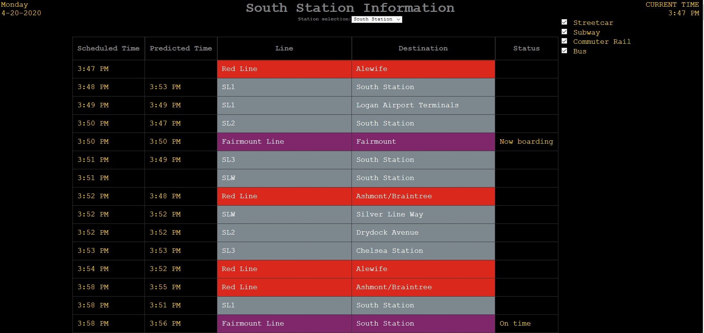

MBTA Schedule Board
========================

# Description
A simple web app built in Python using [Django](https://www.djangoproject.com/) that polls the [MBTA api](https://www.mbta.com/developers/v3-api) to create an info board displaying schedules (as well as predictions) for a few MBTA stations (currently South Station and North Station, although others can be easily added.) 

## Using the app

The app will pull the next six hours of schedule, so the size and contents of the app will change dynamically throughout the day (for example, late at night, fewer items will appear.) Predictions are not always available, especially for schedules further in the future. 

You can change the station by using the drop box on the top center of the screen. The checkboxes on the top right allow you to filter down to only the types of transport you care about, such as commuter rails. To update the schedule board, just reload the page!

# Files of Interest
Many of the files in this project are automatically generated by Django. Files of interest include:

- `scheduleboard/models.py` - Contained the classes used to model the data returned by the MBTA API
- `scheduleboard/services.py` - Contains the functions used to access the MBTA API and convert the resulting JSON into the model objects used by this app
- `scheduleboard/views.py` - Contains the code used to connect the services to the template used to render the schedule board
- `scheduleboard/forms.py` - A very small and simple Django form used to select the station
- `scheduleboard/tests.py` - A few tests to ensure that the services work during various edge cases and that results are returned in chronological order
- `sheduleboard/templates/scheduleboard/index.html` - the template used to render the page, using Django's template language
- `scheduleboard/static/scheduleboard/style.css` - the CSS file used to style the template

# Prerequisites 
-  Python 3.6 or later
    - I recommend [Anaconda](https://www.anaconda.com/distribution/#download-section) for Python beginners
    - Alternatively you can install [Python 3.7](https://www.python.org/downloads/release/python-377/) directly, along with [virtualenv](https://virtualenv.pypa.io/en/latest/installation.html) or the virtual environment manager of your choice
- [Pip](https://pip.pypa.io/en/stable/) (which can be installed in Anaconda with `conda install pip` from the Anaconda Prompt if you went that route)

# Setup
From a command prompt or terminal, run the following. (If you use Anaconda, I recommend the Anaconda prompt.)
1. First, it's recommended you create a virtual environment for the project, for example using Anaconda:
    1. `conda create --name departure-env`
    1. `conda activate departure-env`
1. Install requirements. From the project directory:
	1. `pip install -r requirements.txt`

# Running the Server

From the `/demosite` subdirectory, simply call `python manage.py runserver` from the terminal.

Then, use a web browser to go to (http://127.0.0.1:8000/schedule)

The server can be stopped by hitting ctrl-break in the terminal.

_Note_: The project does not use any database features, so you can ignore the warning about unapplied migration(s), although you may wish to run `python manage.py migrate` to setup the admin features (not used by the schedule board) and to supress the warning.

# Future Work

Several improvements could be made:
- Caching of values: Currently the models are not managed by Django. Schedules could be cached within a database for when the MBTA API is unavailable.
- MBTA API Key: Currently no API key is being used. An [MBTA API Key](https://api-v3.mbta.com/) would support more frequent polling, as well as [Streaming Updates](https://www.mbta.com/developers/v3-api/streaming)
- Adding more stations. This can be done easily by editing the `STATION_CHOICES` object in `demosite/scheduleboard/models.py` with more station-id / station name pairs. 
- UI changes and enhancements. Many such changes can be done easily through the template and css files without having to alter the underlying models or views.
- Deployment to a production server. 
